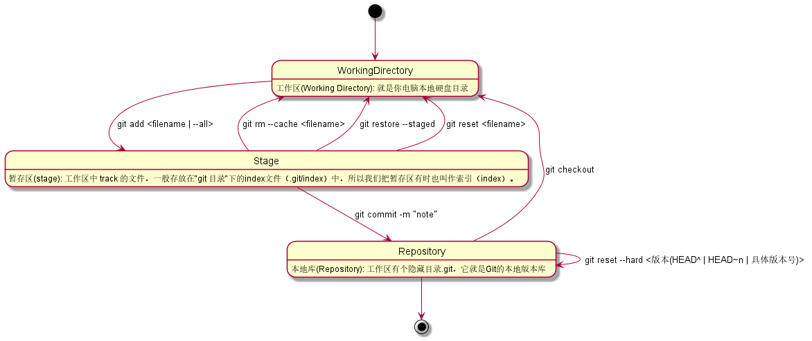
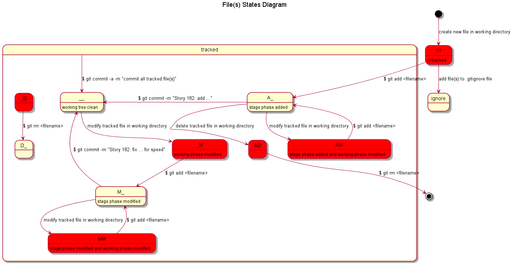

# Git的工作机制

## 三区






关于 track 和 untracked ：

- 红色状态代表在工作区，尚未添加到暂存区！
- 绿色状态代表当前文件已经添加到了暂存区，但是尚未添加到本地库！
- 暂存区空了，代表在所有文件已经添加到本地库；

## Remote Repository Management

```shell
# 将新的本地仓库推送到新的远程仓库
$ git remote add origin <git_url>
$ git push -u origin master

# 如果代码已经由 git 跟踪，设置这个本地仓库为 origin 推送
$ git remote set-url origin <git_url>
$ git push -u origin --all
$ git push origin --tags
```


## git目录

- .git/
  - objects/
    git 本地仓库对象(commit tree blob 类型)
  - refs/
    标示 git 项目分支指向哪次提交 commitID
  - logs/
    每次 refs 的历史记录
  - config
    git 配置信息
  - HEAD
    git 项目当前指针位置
  - index
    git 索引文件
  
- .gitignore

  git ignore file list

- \<files in WorkingDirectory\>

