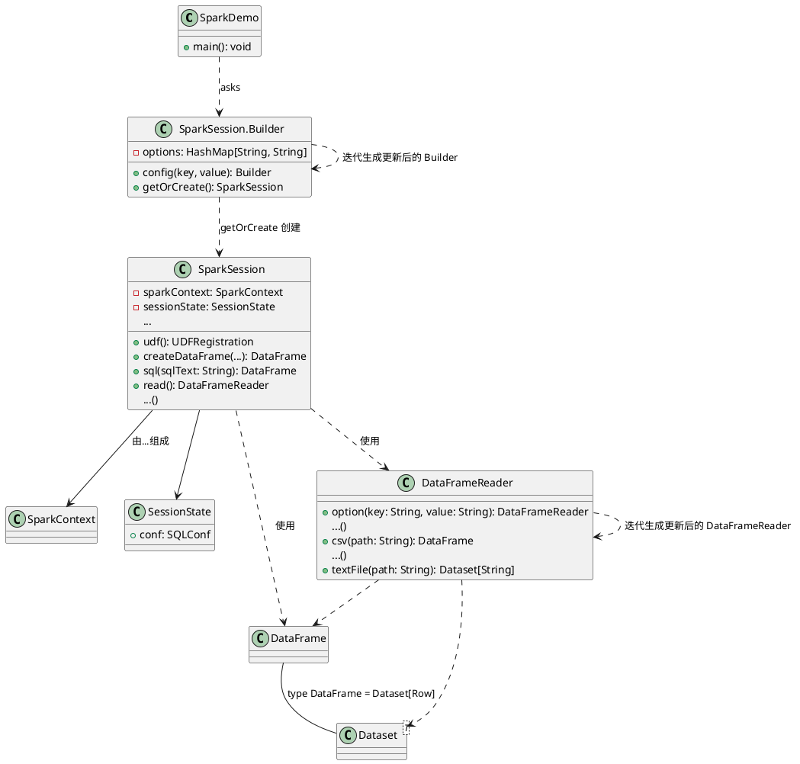

# SparkSession 和建造者模式

> 建造者模式（Builder Pattern）使用多个简单的对象一步一步构建成一个复杂的对象。这种类型的设计模式属于创建型模式，它提供了一种创建对象的最佳方式。
>
> 一个 Builder 类会一步一步构造最终的对象。该 Builder 类是独立于其他对象的。
>
> Ref. [建造者模式 | 菜鸟教程](https://www.runoob.com/design-pattern/builder-pattern.html)

## SparkSession 类图

UML 画图参考：[UML类图与类的关系详解](https://www.cnblogs.com/pangjianxin/p/7877868.html) 

源码参考：spark-sql v2.1.1

## SparkSession 的建造者模式思想

- **意图**

  将一个复杂的 SparkSession 构建与其表示相分离，使得同样的构建过程可以创建不同的表示。

- **主要解决**

  复杂 SparkSession 的构建要考虑到 Thread 的 SparkSession 以及 SparkContext 以及 conf ，

- **何时使用**

- **如何解决**

- **关键代码**

  建造者：`Builder.getOrCreate()` ；导演： `SparkDemo.main()`

- **应用实例**

  SparkSession 的建造者模式

- **优点**

- **缺点**

- **使用场景**

- **注意事项**
