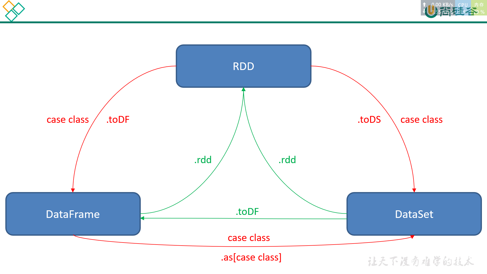

# SparkSQL编程

## SparkSession新的起始点


```scala
val spark = SparkSession.builder().master("local[4]").appName("test").getOrCreate()

import spark.implicits._
```


## DataFrame

DataFrame是一种以RDD为基础的分布式数据集，类似于传统数据库中的二维表格。

### 创建DataFrame

```scala
import spark.implicits._
// 利用集合创建 DataFrame
val list = List(
  Person("zhangsan",20),
  Person("lisi",30),
  Person("wangwu",40),
  Person("zhaoliu",100),
  Person("hanmeimei",18)
)

val df = list.toDF()
```

```scala
// 利用 RDD 创建 DataFrame

val df = rdd.toDF()
```

其他：以文件、MySQL、Hive读取数据[SparkSQL数据的加载与保存.md](SparkSQL数据的加载与保存.md)


### row 类型与 Column 类型

Row类型的取值: `row.getAs[列的类型]("列名")`

```scala
val spark = SparkSession.builder().master("local[4]").appName("test").getOrCreate()

import spark.implicits._
val df = spark.read.textFile("datas/wc.txt").toDF()

val rdd = df.rdd

val rdd2= rdd.flatMap(row=>{
  // row 类型取值
  val value = row.getAs[String]("value")
  value.split(" ")
})

val rdd3 = rdd2.map((_,1))

val df2 = rdd3.toDF("word","num")

df2.createOrReplaceTempView("wc")

spark.sql("select word,count(1) from wc group by word").show()
```


Column创建方式:

1. 无绑定

   1. 通过 '列名 创建

   2. 通过 $"列名" 创建

   3. 通过 col(列名) 创建

   4. 通过 column(列名) 创建

2. 有绑定


```scala
val spark = SparkSession.builder().master("local[4]").appName("test").getOrCreate()
import spark.implicits._
val df =List(
  Person("lisi",20),
  Person("zhangsan",30),
  Person("wangwu",40),
  Person("zhaoliu",100)
).toDF

val df2 =List(
  Person("lisi",20),
  Person("zhangsan",30),
  Person("wangwu",40),
  Person("zhaoliu",100)
).toDF

//通过 '列名 创建
val column1:Column = 'name

//通过 $"列名" 创建
val column2:Column = $"name"

//通过 col(列名) 创建
import org.apache.spark.sql.functions._
val column3 = col("name")

//通过 column(列名) 创建
val column4 = column("name")

df.select(column1).show()

//有绑定适用于多表的时候
//df.col(列名)
val column5 = df.col("name")
df2.select(column5).show()


val column6 = df("name")
df.join(df2,df.col("name")===df2.col("name"))

```


## DataSet

### 创建 DataSet


以文件、MySQL、Hive读取数据[SparkSQL数据的加载与保存.md](SparkSQL数据的加载与保存.md)

## DataFrame 与 DataSet 比较

> DataSet 是 DataFrame 的扩展，是 spark 最新的数据抽象；
>
> dataSet 像个对象，允许我们像操作类一样操作它，通过属性查看数据；
>
> 实际上 DataSet 是在 df 的基础上增加了数据类型(这样表述或许不太准确，可以理解为 类或者对象)的概念
>
> ——[spark教程(九)-sparkSQL 和 RDD-DF-DS 关系](http://www.manongjc.com/detail/12-kejjjjlwsnfjxuh.html)

## SQL风格语法

通过写sql语句操作数据

```scala
//将 DataFrame 注册成表
//注册成临时表,只能在当前 SparkSession 中使用,其他 sparkSession 使用不了
df.createOrReplaceTempView("person") //工作常用
//df.createOrReplaceGlobalTempView("person") 其他sparkSession可以使用，但工作不常用

spark.sql(
  """
    | select
    |   age
    |     from global_temp.person where age>25
  """.stripMargin)//.show

val session = spark.newSession()
session.sql(
  """
    | select
    |   age
    |     from global_temp.person where age>25
  """.stripMargin).show

```


## DSL(Domain Specific Language)风格语法

[SparkSQL编程-DSL风格语法.md](SparkSQL编程-DSL风格语法.md)

##  RDD、DataFrame、DataSet相互转换




## 用户自定义函数

### UDF

```
1、自定义UDF函数:
    1、定义普通函数
        val func = (id:Int) => id+"-001"
    2、注册udf函数: spark.udf.register("函数名",函数)
        spark.udf.register("myfunc",func)
    3、通过sql使用函数:
        spark.sql("select myfunc(id) from 表名")
```


### UDAF

```
2、自定义udaf函数
    1、弱类型udaf：
        1、定义class继承UserDefinedAggregateFunction
        2、重写抽象方法
            def inputSchema: StructType <定义udaf参数类型>
            def bufferSchema: StructType <定义中间变量的参数类型>
            def dataType: DataType <定义最终结果类型>
            def deterministic: Boolean <一致性>
            def initialize(buffer: MutableAggregationBuffer): Unit <初始化中间变量>
            def update(buffer: MutableAggregationBuffer, input: Row): Unit <每次传入组中一个值,更新中间变量>
            def merge(buffer1: MutableAggregationBuffer, buffer2: Row): Unit <合并所有task的统计结果>
            def evaluate(buffer: Row): Any <获取最终结果>
        3、注册udaf: 
            1、创建自定义udaf对象: val obj = new xxx
            2、注册: spark.udf.register("函数名",obj)
    2、强类型的udaf
        1、定义class继承Aggregator[IN,BUF,OUT]
            IN: udaf参数类型
            BUF: 中间变量类型
            OUT: 最终结果类型
        2、重写方法
            def zero: Buff <中间变量赋初始值>
            def reduce(buff: Buff, age: Int): Buff <在每个分区中先预聚合,每个传入一个元素,更新中间结果>
            def merge(b1: Buff, b2: Buff): Buff <对所有分区的结果再次聚合>
            def finish(reduction: Buff): Double <获取最终结果>
            def bufferEncoder: Encoder[Buff] <对中间结果类型编码>
            def outputEncoder: Encoder[Double] <对最终结果类型编码>
        3、注册
            1、创建udaf对象: val obj = new XXX
            2、导入隐式转换,使用udaf函数: 
                import org.apache.spark.sql.functions._
                val uobj = udaf(obj)
            3、注册: spark.udf.register("函数名",uobj)

```

