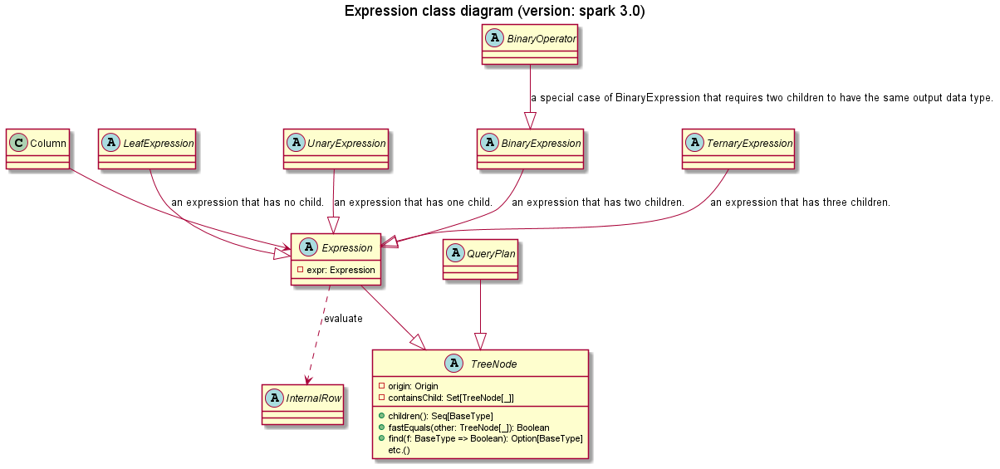

# Expression




## Expression 和 Column operator

对 Column 的操作的分类，一般来说 `org.apache.spark.sql.Column` 中的 operator 用法是 `column.operator` ，而 `org.apache.spark.sql.functions` 的用法是 `operator(column)`

| Expression  case class | Column operator                                              | Column operator location                                    | category                     |
| ---------------------- | ------------------------------------------------------------ | ----------------------------------------------------------- | ---------------------------- |
| UnaryMinus             | `unary_-`                                                    | org.apache.spark.sql.Column                                 | 数学运算 arithmetic          |
| UnaryPositive          |                                                              |                                                             | 数学运算 arithmetic          |
| Abs                    | `abs`                                                        | org.apache.spark.sql.functions                              | 数学运算 arithmetic          |
| Add                    | `+` `plus`                                                   | org.apache.spark.sql.Column                                 | 数学运算 arithmetic          |
| Subtract               | `-` `minus`                                                  | org.apache.spark.sql.Column                                 | 数学运算 arithmetic          |
| Multiply               | `*` `multiply`                                               | org.apache.spark.sql.Column                                 | 数学运算 arithmetic          |
| Divide                 | `/` `divide`                                                 | org.apache.spark.sql.Column                                 | 数学运算 arithmetic          |
| Remainder              | `%` `mod`                                                    | org.apache.spark.sql.Column                                 | 数学运算 arithmetic          |
| Pmod                   | `pmod`                                                       | org.apache.spark.sql.functions                              | 数学运算 arithmetic          |
| Least                  | `least`                                                      | org.apache.spark.sql.functions                              | 数学运算 arithmetic          |
| Greatest               | `greatest`                                                   | org.apache.spark.sql.functions                              | 数学运算 arithmetic          |
| Not                    | `unary_!` `not`                                              | org.apache.spark.sql.Column                                 | predicates                   |
| InSubquery             |                                                              |                                                             | predicates                   |
| In                     | `isin`                                                       | org.apache.spark.sql.Column                                 | predicates                   |
| InSet                  |                                                              |                                                             | predicates                   |
| And                    | `&&` `and`                                                   | org.apache.spark.sql.Column                                 | predicates                   |
| Or                     | `||` `or`                                                    | org.apache.spark.sql.Column                                 | predicates                   |
| EqualTo                | `===` `equalTo`                                              | org.apache.spark.sql.Column                                 | predicates                   |
| EqualNullSafe          | `<=>` `eqNullSafe`                                           | org.apache.spark.sql.Column                                 | predicates                   |
| LessThan               | `<` `lt`                                                     | org.apache.spark.sql.Column                                 | predicates                   |
| LessThanOrEqual        | `<=` `leq`                                                   | org.apache.spark.sql.Column                                 | predicates                   |
| GreaterThan            | `>` `gt`                                                     | org.apache.spark.sql.Column                                 | predicates                   |
| GreaterThanOrEqual     | `>=` `geq`                                                   | org.apache.spark.sql.Column                                 | predicates                   |
| If                     |                                                              |                                                             | conditionalExpressions       |
| CaseWhen               | `when`                                                       | org.apache.spark.sql.functions                              | conditionalExpressions       |
| ConcatWs               | `concat_ws`                                                  | org.apache.spark.sql.functions                              | stringExpressions            |
| Elt                    |                                                              |                                                             | stringExpressions            |
| Upper                  | `upper`                                                      | org.apache.spark.sql.functions                              | stringExpressions            |
| Lower                  | `lower`                                                      | org.apache.spark.sql.functions                              | stringExpressions            |
| Contains               | `contains`                                                   | org.apache.spark.sql.Column                                 | stringExpressions            |
| StartsWith             | `startsWith`                                                 | org.apache.spark.sql.Column                                 | stringExpressions            |
| EndsWith               | `endsWith`                                                   | org.apache.spark.sql.Column                                 | stringExpressions            |
| StringReplace          |                                                              |                                                             | stringExpressions            |
| Overlay                | `overlay`                                                    | org.apache.spark.sql.functions                              | stringExpressions            |
| StringTranslate        | `translate`                                                  | org.apache.spark.sql.functions                              | stringExpressions            |
| FindInSet              |                                                              |                                                             | stringExpressions            |
| StringTrim             | `trim`                                                       | org.apache.spark.sql.functions                              | stringExpressions            |
| StringTrimLeft         | `ltrim`                                                      | org.apache.spark.sql.functions                              | stringExpressions            |
| StringTrimRight        | `rtrim`                                                      | org.apache.spark.sql.functions                              | stringExpressions            |
| StringInstr            | `instr`                                                      | org.apache.spark.sql.functions                              | stringExpressions            |
| ...                    |                                                              |                                                             | stringExpressions            |
| Size                   | `size`                                                       | org.apache.spark.sql.functions                              | collectionOperations 集合    |
| MapKeys                | `map_keys`                                                   | org.apache.spark.sql.functions                              | collectionOperations 集合    |
| ...                    |                                                              |                                                             | collectionOperations 集合    |
| Coalesce               | `coalesce`                                                   | org.apache.spark.sql.functions                              | 判断 NULL值 nullExpressions  |
| IfNull                 |                                                              |                                                             | 判断 NULL值 nullExpressions  |
| NullIf                 |                                                              |                                                             | 判断 NULL值 nullExpressions  |
| Nvl                    |                                                              |                                                             | 判断 NULL值 nullExpressions  |
| IsNaN                  | `isNaN`                                                      | org.apache.spark.sql.functions, org.apache.spark.sql.Column | 判断 NULL值 nullExpressions  |
| NaNvl                  | `nanvl`                                                      | org.apache.spark.sql.functions                              | 判断 NULL值 nullExpressions  |
| IsNull                 | `isNull`                                                     | org.apache.spark.sql.functions, org.apache.spark.sql.Column | 判断 NULL值 nullExpressions  |
| IsNotNull              | `isNotNull`                                                  | org.apache.spark.sql.Column                                 | 判断 NULL值 nullExpressions  |
| AtLeastNNonNulls       |                                                              |                                                             | 判断 NULL值 nullExpressions  |
| Like                   | `like`                                                       | org.apache.spark.sql.Column                                 | regexpExpressions            |
| RLike                  | `rlike`                                                      | org.apache.spark.sql.Column                                 | regexpExpressions            |
| StringSplit            | `split`                                                      | org.apache.spark.sql.functions                              | regexpExpressions            |
| RegExpReplace          | `regexp_replace`                                             | org.apache.spark.sql.functions                              | regexpExpressions            |
| RegExpExtract          | `regexp_extract`                                             | org.apache.spark.sql.functions                              | regexpExpressions            |
| ExprId                 |                                                              |                                                             | 别名 namedExpressions        |
| Alias                  | `name`, `alias`                                              | org.apache.spark.sql.Column                                 | 别名 namedExpressions        |
| AttributeReference     |                                                              |                                                             | 别名 namedExpressions        |
| OuterReference         |                                                              |                                                             | 别名 namedExpressions        |
| Cast                   | `cast`                                                       | org.apache.spark.sql.Column                                 | 类型转换 Cast                |
| AnsiCast               |                                                              |                                                             | 类型转换 Cast                |
| UpCast                 |                                                              |                                                             | 类型转换 Cast                |
| SortOrder              | `desc` `desc_nulls_first` `desc_nulls_last` `asc` `asc_nulls_first` `asc_nulls_last` | org.apache.spark.sql.Column                                 | SortOrder                    |
| SortPrefix             |                                                              |                                                             | SortOrder                    |
| BitwiseAnd             | `bitwiseAND`                                                 | org.apache.spark.sql.Column                                 | 位运算 bitwiseExpressions    |
| BitwiseOr              | `bitwiseOR`                                                  | org.apache.spark.sql.Column                                 | 位运算 bitwiseExpressions    |
| BitwiseXor             | `bitwiseXOR`                                                 | org.apache.spark.sql.Column                                 | 位运算 bitwiseExpressions    |
| BitwiseNot             | `bitwiseNOT`                                                 | org.apache.spark.sql.functions                              | 位运算 bitwiseExpressions    |
| BitwiseCount           |                                                              |                                                             | 位运算 bitwiseExpressions    |
|                        |                                                              |                                                             | 日期时间 datetimeExpressions |
|                        |                                                              |                                                             | 日期时间 datetimeExpressions |
| Lead                   | `lead`                                                       | org.apache.spark.sql.functions                              | windowExpressions            |
| Lag                    | `lag`                                                        | org.apache.spark.sql.functions                              | windowExpressions            |
| RowNumber              | `row_number`                                                 | org.apache.spark.sql.functions                              | windowExpressions            |
| CumeDist               | `cume_dist`                                                  | org.apache.spark.sql.functions                              | windowExpressions            |
| NTile                  | `ntile`                                                      | org.apache.spark.sql.functions                              | windowExpressions            |
| Rank                   | `rank`                                                       | org.apache.spark.sql.functions                              | windowExpressions            |
| DenseRank              | `dense_rank`                                                 | org.apache.spark.sql.functions                              | windowExpressions            |
| PercentRank            | `percent_rank`                                               | org.apache.spark.sql.functions                              | windowExpressions            |
| ...                    |                                                              |                                                             |                              |

<center>Expression 和 Column operator 映射表(version: spark 3.0)</center>

测试上面这些 operator/function 的方法:

```
scala> // Built-in Functions Test in DSL


scala> Seq("").toDF.select(lit(1) + lit(1)).show
+-------+
|(1 + 1)|
+-------+
|      2|
+-------+


scala> Seq("").toDF.select(base64(lit("spark sql"))).show
+-----------------+
|base64(spark sql)|
+-----------------+
|     c3Bhcmsgc3Fs|
+-----------------+


scala> Seq("").toDF.select(unbase64(lit("c3Bhcmsgc3Fs")).cast("string")).show
+--------------------------------------+
|CAST(unbase64(c3Bhcmsgc3Fs) AS STRING)|
+--------------------------------------+
|                             spark sql|
+--------------------------------------+


scala> // 对于 DSL api 中没有而 SQL 中有的函数，可以使用 callUDF

scala> Seq("").toDF.select(callUDF("parse_url", lit("http://spark.apache.org/path?query=1"), lit("HOST"))).show
+-----------------------------------------------------+
|parse_url(http://spark.apache.org/path?query=1, HOST)|
+-----------------------------------------------------+
|                                     spark.apache.org|
+-----------------------------------------------------+

```

```
scala> // Built-in Functions Test in SQL Query

scala> spark.sql("select base64('spark_sql')").show
+---------------------------------+
|base64(CAST(spark_sql AS BINARY))|
+---------------------------------+
|                     c3Bhcmtfc3Fs|
+---------------------------------+

```

## 如何继承 Expression 编写底层工具类？


```
change log
2021年10月26日 ADD: Expression 和 Column operator 映射表
```

## UserDefinedFunction

[2021-11-12-UserDefinedFunction.md](2021-11-12-UserDefinedFunction.md)
