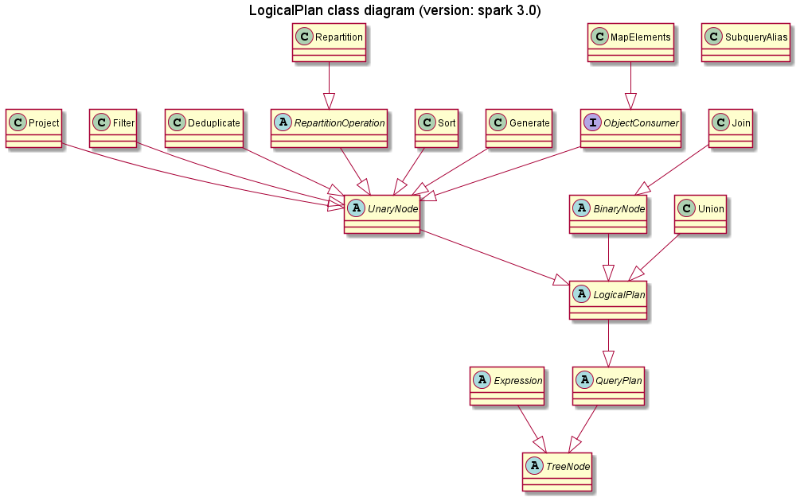

# LogicalPlan

- LogicalPlan
  - operators
    - Expression




## LogicalPlan 和 DataSet operator(算子)

| LogicalPlan case class | DataSet operator      |
| ---------------------- | --------------------- |
| MapElements            | map                   |
| MapPartitions          | mapPartitions         |
| Project                | select                |
| Filter                 | filter, where         |
| Join                   | join                  |
| Deduplicate            | distinct              |
| Union                  | union                 |
| Repartition            | coalesce, repartition |
| Sort                   | sort, order           |
| Generate               | explode               |
| SubqueryAlias          | alias, as             |
| Aggregate              | groupBy + agg         |
|                        |                       |


```
change log
2021年10月26日 ADD: LogicalPlan case class 和 DataSet operator 映射表
```

